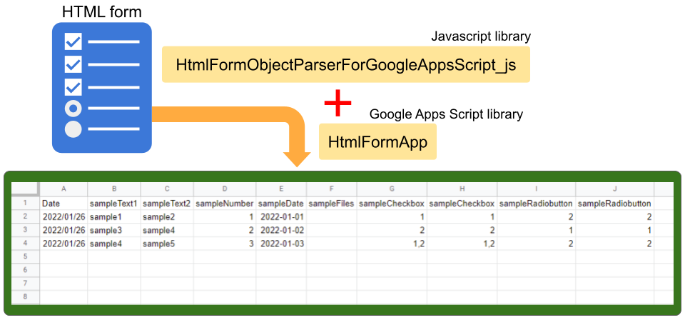

# HtmlFormApp

<a name="top"></a>
[](LICENCE)

<a name="overview"></a>

# Overview



This is a Google Apps Script library for parsing the form object from HTML form and appending the submitted values to the Spreadsheet.

<a name="description"></a>

## Description

There is Google Form in the Google service. Google Form can parse the submitted data and put it in the Spreadsheet. But when we want to use the custom form, it is required to use the HTML form on Web Apps, dialog, and sidebar. In this case, it is required to prepare Javascript and Google Apps Script for parsing the form object from the HTML form and appending the parsed values to Spreadsheet. Recently, a bug of the built-in parser from the Javascript side to the Google Apps Script side for parsing the form object from the HTML form had been removed. [Ref](https://tanaikech.github.io/2021/12/09/fixed-google-apps-script-web-app-html-form-file-input-fields-not-in-blob-compatible-format/) But, in the current stage, this bug is removed for only Web Apps. Unfortunately, for the dialog and sidebar, this bug has never been removed. And also, unfortunately, the built-in parser from the Javascript side to the Google Apps Script side cannot be used for the multiple files of the input tag. And, this cannot be used except for `google.script.run`. For example, when the HTML form including the files is submitted using "action" of the form tag, the file content is not included. And then, when the form object is retrieved, it is required to parse the object and put it in the Spreadsheet. From these situations, I thought that when this process can be run using the libraries, that might be useful for users. So I created this.

This Google Apps Script library uses a Javascript library of [HtmlFormObjectParserForGoogleAppsScript_js](https://github.com/tanaikech/HtmlFormObjectParserForGoogleAppsScript_js). The form object from the HTML form is parsed using the Javascript library and sent to Google Apps Script side, and the object from Javascript is parsed and put to Spreadsheet using this Google Apps Script library.

## `medium.com`

[Easily Implementing HTML Form with Google Spreadsheet as Database using Google Apps Script](https://medium.com/google-cloud/easily-implementing-html-form-with-google-spreadsheet-as-database-using-google-apps-script-66472ab7bf6c)

# Library's project key

```
1uLJrVXGaI-ceHFl_VC1U5jcynKpR2qnNG2tNPd03QJZw1jCcKw2_Oiwh
```

# Methods

| Methods                                   | Description                                                                                                                                                                                  |
| :---------------------------------------- | :------------------------------------------------------------------------------------------------------------------------------------------------------------------------------------------- |
| [appendFormData(object, row)](#appendFormData) | Parsing the form object parsed by [HtmlFormObjectParserForGoogleAppsScript_js](https://github.com/tanaikech/HtmlFormObjectParserForGoogleAppsScript_js) and append the value to Spreadsheet. |

## About scopes

This library use the scopes of `https://www.googleapis.com/auth/drive` and `https://www.googleapis.com/auth/spreadsheets`.

<a name="usage"></a>

# Usage:

## 1. Install library

In order to use this library, please install this library as follows.

1. Create a GAS project.

   - You can use this library for the GAS project of both the standalone type and the container-bound script type.

1. [Install this library](https://developers.google.com/apps-script/guides/libraries).

   - Library's project key is **`1uLJrVXGaI-ceHFl_VC1U5jcynKpR2qnNG2tNPd03QJZw1jCcKw2_Oiwh`**.

## Methods

<a name="appendFormData"></a>

### appendFormData

This method parses the form object parsed by [HtmlFormObjectParserForGoogleAppsScript_js](https://github.com/tanaikech/HtmlFormObjectParserForGoogleAppsScript_js) and appends the value to Spreadsheet.

```javascript
// These are all options.
const obj = {
   formData: formData,
   spreadsheetId: "###",
   sheetName: "###",
   sheetId: "###",
   folderId: "###",
   headerConversion: {"header value of Spreadsheet": "name of HTML input tag",,,},
   ignoreHeader: true,
   choiceFormat: true,
   delimiterOfMultipleAnswers: "\n",
   valueAsRaw: true
};
const res = HtmlFormApp.appendFormData(obj);
console.log(res)
```

#### Input object

- **formData**: Form object from HtmlFormObjectParserForGoogleAppsScript_js

- **spreadsheetId**: Spreadsheet ID you want to put the values.

  - When `spreadsheetId` is not used, the values are put to the 1st sheet of the created new Spreadsheet.

- **sheetName**: Sheet name you want to put the values. Default is 1st sheet. When you don't use this, the value is put on the 1st sheet.

- **sheetId**: Sheet ID you want to put the values. Default is 1st sheet. When you don't use this, the value is put on the 1st sheet.

- **folderId**: Folder ID of the folder putting the submitted file. Default is "root". When you don't use this, the submitted files are put to the root folder.

- **headerConversion**: When the header values in the sheet are different from each name of the HTML form, you can put the values to the sheet using this object.

  - For example, when the names of input tags in HTML form are "sample1", "sample2", "sample3", and when the header row is "test1", "test2", "test3", you can set `headerConversion` as `headerConversion: {"test1": "sample1", "test2": "sample2", "test3": "sample3"}`.

- **ignoreHeader**: When this value is true, the submitted values are put to the sheet without using the header row. Default is false.

- **choiceFormat**: When the HTML form includes the multiple-choice like the checkboxes and radio button, when this value is true, values both true and false are put to the sheet like `value1(checked)\nvalue2(unchecked)`. Default is false. When this value is false, only values when it is true are put on the sheet.

- **delimiterOfMultipleAnswers**: When the multiple answers are included in an input tag, the values are put to the sheet using this delimiter. Default is ",".

- **valueAsRaw**: When this value is `true`, the raw values retrieved from HTML form are used. Default is `false`. When this value is not used to `false`, for example, the date is converted to the date object.

- About 2nd argument of `appendFormData(object, row)`, this is from [this suggestion](https://github.com/tanaikech/HtmlFormApp/issues/1). When `row` is used, the value is put into the specific row of the Spreadsheet. In this case, please set the value of `row` more than 1.
  - In this case, the submitted row can be forcefully put into the specific row of Google Spreadsheet. So, when you run `appendFormData(object, row)` by the constant value of `row`, the submitted row is put into the same row. Please be careful about this.

#### Output object

This method of `appendFormData` returns the following object.

```json
{
  "spreadsheet": "Class Spreadsheet",
  "sheet": "Class Sheet",
  "range": "Class Range",
  "values": "values put to the sheet"
}
```

By using this, you can retrieve the range of the submitted row like `res.range.getRow()`.

#### Simple sample script

For example, when you want to use this library as a simple mode, you can use the following script.

```javascript
const obj = {
  formData: formData,
  spreadsheetId: "###",
};
const res = HtmlFormApp.appendFormData(obj);
console.log(res);
```

In this script, the form data is append to the 1st sheet of "spreadsheetId".

# Sample scripts

In the current stage, in order to submit the values using an HTML form, it is considered the following situations. Here, I would like to introduce the sample scripts for each situation using this library.

"Multiple files", "Single file" and "No files" indicate whether the multiple files (using `multiple` in the input tag.) can be uploaded using the HTML form. Even when "Single file" is indicated, when you put the multiple input tags (`type="file"`) without using `multiple`, you can upload the multiple files.

Of course, the values from the inputted texts, checkboxes, radio buttons, dropdown lists can be retrieved for all situations.

| Situations                                                                                                                                                                                                                                         | Multiple files | Single file | Sample scripts      |
| :------------------------------------------------------------------------------------------------------------------------------------------------------------------------------------------------------------------------------------------------- | :------------- | :---------- | :------------------ |
| Using HtmlFormObjectParserForGoogleAppsScript_js, the form object is sent from HTML side to Google Apps Script side by `google.script.run` on the dialog, sidebar and Web Apps.                                                                    | Yes            | Yes         | [Sample1](#sample1) |
| Using HtmlFormObjectParserForGoogleAppsScript_js, the form object is sent from HTML side to Google Apps Script by `fetch` of Javascript with the POST method on the dialog, sidebar, Web Apps and HTML in other site.                              | Yes            | Yes         | [Sample2](#sample2) |
| Using HtmlFormObjectParserForGoogleAppsScript_js, the form object is sent from HTML side to Google Apps Script by `fetch` of Javascript with the GET method on the dialog, sidebar, Web Apps and HTML in other site.                               |                |             | [Sample3](#sample3) |
| The form object is sent from HTML side to Google Apps Script by the parser like `google.script.run.myFunction(e.parentNode)` on the Web Apps.                                                                                                      |                | Yes         | [Sample4](#sample4) |
| The form object is sent from HTML side to Google Apps Script by the parser like `google.script.run.myFunction(e.parentNode)` on the dialog and sidebar.                                                                                            |                |             | [Sample4](#sample4) |
| The form object is sent from HTML side to Google Apps Script by `<form method="POST" action="https://script.google.com/macros/s/###/exec">` of the form tag on the dialog, sidebar, Web Apps and HTML in other site.                               |                |             | [Sample5](#sample5) |
| The form object is sent from HTML side to Google Apps Script by `<form method="POST" action="https://script.google.com/macros/s/###/exec" enctype="multipart/form-data">` of the form tag on the dialog, sidebar, Web Apps and HTML in other site. |                |             | [Sample6](#sample6) |

<a name="sample1"></a>

## 1. Sample 1

Using HtmlFormObjectParserForGoogleAppsScript_js, the form object is sent from HTML side to Google Apps Script side by `google.script.run` on the dialog, sidebar.

### HTML and Javascript side: `index.html`

Please copy and paste this script to the script editor of Spreadsheet as a HTML file. This sample uses a dialog.

```html
<form>
  Text1: <input type="text" name="sampleText1" /><br />
  Text2: <input type="text" name="sampleText2" /><br />
  Number: <input type="number" name="sampleNumber" /><br />
  Date: <input type="date" name="sampleDate" /><br />
  File: <input type="file" name="sampleFiles" multiple /><br />
  CheckBox: <input type="checkbox" name="sampleCheckbox" value="1" />1<br />
  CheckBox: <input type="checkbox" name="sampleCheckbox" value="2" />2<br />
  Radiobutton: <input type="radio" name="sampleRadiobutton" value="1" />1<br />
  Radiobutton: <input type="radio" name="sampleRadiobutton" value="2" />2<br />
  <input
    type="submit"
    name="button"
    value="submit"
    onclick="run(this);return false;"
  />
</form>

<script src="https://cdn.jsdelivr.net/gh/tanaikech/HtmlFormObjectParserForGoogleAppsScript_js/htmlFormObjectParserForGoogleAppsScript_js.min.js"></script>

<script>
  async function run(e) {
    const obj = await ParseFormObjectForGAS(e.parentNode, null, null, true);
    google.script.run
      .withFailureHandler((err) => console.log(err.message))
      .withSuccessHandler((res) => console.log(res))
      .main(obj);
  }
</script>
```

At `ParseFormObjectForGAS` method, the attribution of `name` of each input tag is used as the key of the parsed form object.

### Google Apps Script side: `Code.gs`

Please copy and paste this script to the script editor of Spreadsheet as a script file. And please set your Spreadsheet ID. And, please run `myFunction`. By this, a dialog is opened. When you input the values into the dialog and click the submit button, the values are put on the 1st sheet of the Spreadsheet.

```javascript
function myFunction() {
  const html = HtmlService.createHtmlOutputFromFile("index");
  SpreadsheetApp.getUi().showDialog(html);
}

function main(formData) {
  const obj = {
    formData: formData,
    spreadsheetId: "###spreadsheetId###",
    ignoreHeader: true,
  };
  const res = HtmlFormApp.appendFormData(obj);
  console.log(res.range.getRow());
  return "Done";
}
```

- If you want to put the values using the header row, please set the header row to the Spreadsheet and remove `ignoreHeader: true,`.

<a name="sample2"></a>

## 2. Sample 2

Using HtmlFormObjectParserForGoogleAppsScript_js, the form object is sent from HTML side to Google Apps Script side by `google.script.run` on Web Apps.

### HTML and Javascript side: `index.html`

Please create a HTML file including this script. And please set your Web Apps URL.

```html
<form>
  Text1: <input type="text" name="sampleText1" /><br />
  Text2: <input type="text" name="sampleText2" /><br />
  Number: <input type="number" name="sampleNumber" /><br />
  Date: <input type="date" name="sampleDate" /><br />
  File: <input type="file" name="sampleFiles" multiple /><br />
  CheckBox: <input type="checkbox" name="sampleCheckbox" value="1" />1<br />
  CheckBox: <input type="checkbox" name="sampleCheckbox" value="2" />2<br />
  Radiobutton: <input type="radio" name="sampleRadiobutton" value="1" />1<br />
  Radiobutton: <input type="radio" name="sampleRadiobutton" value="2" />2<br />
  <input
    type="submit"
    name="button"
    value="submit"
    onclick="run(this);return false;"
  />
</form>

<script src="https://cdn.jsdelivr.net/gh/tanaikech/HtmlFormObjectParserForGoogleAppsScript_js/htmlFormObjectParserForGoogleAppsScript_js.min.js"></script>

<script>
  async function run(e) {
    const url = "https://script.google.com/macros/s/###/exec"; // Please set your Web Apps URL here.

    const obj = await ParseFormObjectForGAS(e.parentNode, null, null, true);
    fetch(url, { method: "POST", body: JSON.stringify(obj) })
      .then((res) => res.json())
      .then((res) => console.log(res));
  }
</script>
```

- At `ParseFormObjectForGAS` method, the attribution of `name` of each input tag is used as the key of the parsed form object.

### Google Apps Script side: `Code.gs`

```javascript
function doPost(e) {
  const obj = {
    formData: e,
    spreadsheetId: "###spreadsheetId###",
    ignoreHeader: true,
  };
  const res = HtmlFormApp.appendFormData(obj);
  return ContentService.createTextOutput(
    JSON.stringify({ message: "Done", row: res.range.getRow() })
  );
}
```

1. Please copy and paste this script to the script editor of Google Apps Script. Of course, you can use both the standalone type and the container-bound script type as the Google Apps Script project. And please set your Spreadsheet ID.

2. Please deploy Web Apps as `Execute as: Me` and `Who has access to the app: Anyone`. You can see how to deploy Web Apps at [here](https://developers.google.com/apps-script/guides/web).

   - When you modified the Google Apps Script, please modify the deployment as a new version. By this, the modified script is reflected in Web Apps. Please be careful about this.
   - You can see the detail of this in the report of "[Redeploying Web Apps without Changing URL of Web Apps for new IDE](https://gist.github.com/tanaikech/ebf92d8f427d02d53989d6c3464a9c43)".

3. Please open your HTML file using your browser. When you input the values into the dialog and click the submit button, the values are put on the 1st sheet of the Spreadsheet.

- If you want to put the values using the header row, please set the header row to the Spreadsheet and remove `ignoreHeader: true,`.

<a name="sample3"></a>

## 3. Sample 3

Using HtmlFormObjectParserForGoogleAppsScript_js, the form object is sent from HTML side to Google Apps Script by `fetch` of Javascript with the GET method on the dialog, sidebar, Web Apps and HTML in other site.

**In this sample, the files cannot be uploaded. Please be careful this.**

### HTML and Javascript side: `index.html`

Please create an HTML file including this script. And please set your Web Apps URL. Of course, you can also use this HTML and Javascript on a dialog and sidebar.

```html
<form>
  Text1: <input type="text" name="sampleText1" /><br />
  Text2: <input type="text" name="sampleText2" /><br />
  Number: <input type="number" name="sampleNumber" /><br />
  Date: <input type="date" name="sampleDate" /><br />
  <!-- File: <input type="file" name="sampleFiles" multiple /><br /> -->
  CheckBox: <input type="checkbox" name="sampleCheckbox" value="1" />1<br />
  CheckBox: <input type="checkbox" name="sampleCheckbox" value="2" />2<br />
  Radiobutton: <input type="radio" name="sampleRadiobutton" value="1" />1<br />
  Radiobutton: <input type="radio" name="sampleRadiobutton" value="2" />2<br />
  <input
    type="submit"
    name="button"
    value="submit"
    onclick="run(this);return false;"
  />
</form>

<script src="https://cdn.jsdelivr.net/gh/tanaikech/HtmlFormObjectParserForGoogleAppsScript_js/htmlFormObjectParserForGoogleAppsScript_js.min.js"></script>

<script>
  async function run(e) {
    let url = "https://script.google.com/macros/s/###/exec"; // Please set your Web Apps URL here.

    const obj = await ParseFormObjectForGAS(e.parentNode, null, null, true);
    fetch(url + "?formData=" + JSON.stringify(obj))
      .then((res) => res.json())
      .then((res) => console.log(res));
  }
</script>
```

- At `ParseFormObjectForGAS` method, the attribution of `name` of each input tag is used as the key of the parsed form object.

- **In this case, the maximum length of the URL is 2 kb. So if you want to include the file, please be careful this.**

### Google Apps Script side: `Code.gs`

```javascript
function doGet(e) {
  const obj = {
    formData: e,
    spreadsheetId: "###spreadsheetId###",
    ignoreHeader: true,
  };
  const res = HtmlFormApp.appendFormData(obj);
  return ContentService.createTextOutput(
    JSON.stringify({ message: "Done", row: res.range.getRow() })
  );
}
```

1. Please copy and paste this script to the script editor of Google Apps Script. Of course, you can use both the standalone type and the container-bound script type as the Google Apps Script project. And please set your Spreadsheet ID.

2. Please deploy Web Apps as `Execute as: Me` and `Who has access to the app: Anyone`. You can see how to deploy Web Apps at [here](https://developers.google.com/apps-script/guides/web).

   - When you modified the Google Apps Script, please modify the deployment as a new version. By this, the modified script is reflected in Web Apps. Please be careful about this.
   - You can see the detail of this in the report of "[Redeploying Web Apps without Changing URL of Web Apps for new IDE](https://gist.github.com/tanaikech/ebf92d8f427d02d53989d6c3464a9c43)".

3. Please open your HTML file using your browser. When you input the values into the dialog and click the submit button, the values are put on the 1st sheet of the Spreadsheet.

- If you want to put the values using the header row, please set the header row to the Spreadsheet and remove `ignoreHeader: true,`.

<a name="sample4"></a>

## 4. Sample 4

The form object is sent from HTML side to Google Apps Script by the parser like `google.script.run.myFunction(e.parentNode)` on the Web Apps.

**In this sample, only one file can be uploaded. Please be careful this.**

Also, you can use this with the dialog and sidebar. But in the current stage, in order to parse `e.parentNode` with `google.script.run` on the dialog and sidebar, unfortunately, the file cannot be parsed. So please be careful about this. [Ref](https://issuetracker.google.com/issues/155109626)

### HTML and Javascript side: `index.html`

Please create an HTML file including this script. And please set your Web Apps URL. Of course, you can also use this HTML and Javascript on a dialog and sidebar.

```html
<form>
  Text1: <input type="text" name="sampleText1" /><br />
  Text2: <input type="text" name="sampleText2" /><br />
  Number: <input type="number" name="sampleNumber" /><br />
  Date: <input type="date" name="sampleDate" /><br />
  File: <input type="file" name="sampleFiles" /><br />
  CheckBox: <input type="checkbox" name="sampleCheckbox" value="1" />1<br />
  CheckBox: <input type="checkbox" name="sampleCheckbox" value="2" />2<br />
  Radiobutton: <input type="radio" name="sampleRadiobutton" value="1" />1<br />
  Radiobutton: <input type="radio" name="sampleRadiobutton" value="2" />2<br />
  <input
    type="submit"
    name="button"
    value="submit"
    onclick="run(this);return false;"
  />
</form>

<script>
  async function run(e) {
    google.script.run
      .withFailureHandler((err) => console.log(err.message))
      .withSuccessHandler((res) => console.log(res))
      .main(e.parentNode);
  }
</script>
```

- At `ParseFormObjectForGAS` method, the attribution of `name` of each input tag is used as the key of the parsed form object.

- **In this case, the maximum length of the URL is 2 kb. So if you want to include the file, please be careful this.**

### Google Apps Script side: `Code.gs`

Please copy and paste this script to the script editor of Spreadsheet as a script file. And please set your Spreadsheet ID. And, please run `myFunction`. By this, a dialog is opened. When you input the values into the dialog and click the submit button, the values are put on the 1st sheet of the Spreadsheet.

```javascript
function myFunction() {
  const html = HtmlService.createHtmlOutputFromFile("index");
  SpreadsheetApp.getUi().showDialog(html);
}

function main(formData) {
  const obj = {
    formData: formData,
    spreadsheetId: "###spreadsheetId###",
    ignoreHeader: true,
  };
  const res = HtmlFormApp.appendFormData(obj);
  console.log(res.range.getRow());
  return "Done";
}
```

- If you want to put the values using the header row, please set the header row to the Spreadsheet and remove `ignoreHeader: true,`.

<a name="sample5"></a>

## 5. Sample 5

The form object is sent from HTML side to Google Apps Script by `<form method="POST" action="https://script.google.com/macros/s/###/exec">` of the form tag on the dialog, sidebar, Web Apps and HTML in other site.

**In this sample, the files cannot be uploaded. Please be careful this.**

### HTML and Javascript side: `index.html`

Please create an HTML file including this script. And please set your Web Apps URL. Of course, you can also use this HTML and Javascript on a dialog and sidebar.

```html
<form method="POST" action="https://script.google.com/macros/s/###/exec">
  Text1: <input type="text" name="sampleText1" /><br />
  Text2: <input type="text" name="sampleText2" /><br />
  Number: <input type="number" name="sampleNumber" /><br />
  Date: <input type="date" name="sampleDate" /><br />
  CheckBox: <input type="checkbox" name="sampleCheckbox" value="1" />1<br />
  CheckBox: <input type="checkbox" name="sampleCheckbox" value="2" />2<br />
  Radiobutton: <input type="radio" name="sampleRadiobutton" value="1" />1<br />
  Radiobutton: <input type="radio" name="sampleRadiobutton" value="2" />2<br />
  <input type="submit" name="button" value="submit" />
</form>
```

### Google Apps Script side: `Code.gs`

```javascript
function doPost(e) {
  const obj = {
    formData: e,
    spreadsheetId: "###spreadsheetId###",
    ignoreHeader: true,
  };
  const res = HtmlFormApp.appendFormData(obj);
  return ContentService.createTextOutput(
    JSON.stringify({ message: "Done", row: res.range.getRow() })
  );
}
```

1. Please copy and paste this script to the script editor of Google Apps Script. Of course, you can use both the standalone type and the container-bound script type as the Google Apps Script project. And please set your Spreadsheet ID.

2. Please deploy Web Apps as `Execute as: Me` and `Who has access to the app: Anyone`. You can see how to deploy Web Apps at [here](https://developers.google.com/apps-script/guides/web).

   - When you modified the Google Apps Script, please modify the deployment as a new version. By this, the modified script is reflected in Web Apps. Please be careful about this.
   - You can see the detail of this in the report of "[Redeploying Web Apps without Changing URL of Web Apps for new IDE](https://gist.github.com/tanaikech/ebf92d8f427d02d53989d6c3464a9c43)".

3. Please open your HTML file using your browser. When you input the values into the dialog and click the submit button, the values are put on the 1st sheet of the Spreadsheet.

- If you want to put the values using the header row, please set the header row to the Spreadsheet and remove `ignoreHeader: true,`.

<a name="sample6"></a>

## 6. Sample 6

The form object is sent from HTML side to Google Apps Script by `<form method="POST" action="https://script.google.com/macros/s/###/exec" enctype="multipart/form-data">` of the form tag on the dialog, sidebar, Web Apps and HTML in other site.

**In this sample, the files cannot be uploaded. Please be careful this.**

### HTML and Javascript side: `index.html`

Please create a HTML file including this script. And please set your Web Apps URL. Of course, you can also use this HTML and Javascript on a dialog and sidebar.

```html
<form
  method="POST"
  action="https://script.google.com/macros/s/###/exec"
  enctype="multipart/form-data"
>
  Text1: <input type="text" name="sampleText1" /><br />
  Text2: <input type="text" name="sampleText2" /><br />
  Number: <input type="number" name="sampleNumber" /><br />
  Date: <input type="date" name="sampleDate" /><br />
  CheckBox: <input type="checkbox" name="sampleCheckbox" value="1" />1<br />
  CheckBox: <input type="checkbox" name="sampleCheckbox" value="2" />2<br />
  Radiobutton: <input type="radio" name="sampleRadiobutton" value="1" />1<br />
  Radiobutton: <input type="radio" name="sampleRadiobutton" value="2" />2<br />
  <input type="submit" name="button" value="submit" />
</form>
```

### Google Apps Script side: `Code.gs`

```javascript
function doPost(e) {
  const obj = {
    formData: e,
    spreadsheetId: "###spreadsheetId###",
    ignoreHeader: true,
  };
  const res = HtmlFormApp.appendFormData(obj);
  return ContentService.createTextOutput(
    JSON.stringify({ message: "Done", row: res.range.getRow() })
  );
}
```

1. Please copy and paste this script to the script editor of Google Apps Script. Of course, you can use both the standalone type and the container-bound script type as the Google Apps Script project. And please set your Spreadsheet ID.

2. Please deploy Web Apps as `Execute as: Me` and `Who has access to the app: Anyone`. You can see how to deploy Web Apps at [here](https://developers.google.com/apps-script/guides/web).

   - When you modified the Google Apps Script, please modify the deployment as a new version. By this, the modified script is reflected in Web Apps. Please be careful about this.
   - You can see the detail of this in the report of "[Redeploying Web Apps without Changing URL of Web Apps for new IDE](https://gist.github.com/tanaikech/ebf92d8f427d02d53989d6c3464a9c43)".

3. Please open your HTML file using your browser. When you input the values into the dialog and click the submit button, the values are put on the 1st sheet of the Spreadsheet.

- If you want to put the values using the header row, please set the header row to the Spreadsheet and remove `ignoreHeader: true,`.

## IMPORTANT

- **This library uses V8 runtime. So please enable V8 at the script editor.**

- In the above method, when a file is uploaded, the maximum file size is 50 MB because of the current specification on the Google side. Please be careful about this.

## Limitations

As a limitation, in the current stage, the maximum blob size for creating files using Google Apps Script is 50 MB. So when the large file is uploaded, the file cannot be used. Please be careful about this.

---

<a name="licence"></a>

# Licence

[MIT](LICENCE)

<a name="author"></a>

# Author

[Tanaike](https://tanaikech.github.io/about/)

<a name="updatehistory"></a>

# Update History

- v1.0.0 (February 1, 2022)

  1. Initial release.

- v1.0.1 (May 29, 2023)

  1. When multiple files are uploaded, each URL was set as the hyperlink.

- v1.0.2 (October 17, 2023)

  1. The 2nd argument `row` of `appendFormData(object, row)` was added. This is from [this suggestion](https://github.com/tanaikech/HtmlFormApp/issues/1). When `row` is used, the value is put into the specific row of the Spreadsheet. In this case, please set the value of `row` more than 1.

      - In this case, the submitted row can be forcefully put into the specific row of Google Spreadsheet. So, when you run `appendFormData(object, row)` by the constant value of `row`, the submitted row is put into the same row. Please be careful about this.

[TOP](#top)
